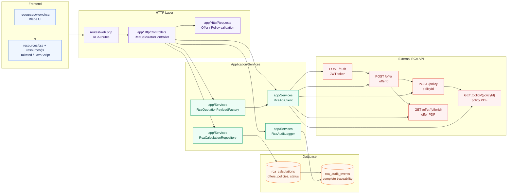

# Diagrama de pachete - Calculator RCA

## Responsabilitatea pachetelor

| Pachet | Responsabilitate |
| --- | --- |
| `Frontend` | Colectează datele utilizatorului și afișează ofertele, polițele și documentele |
| `HTTP Layer` | Definește rutele, validează inputul și orchestrează cazurile de utilizare |
| `Application Services` | Construiește payload-uri, apelează API-ul și persistă rezultatele |
| `Database` | Păstrează calculele, identificatorii API, răspunsurile și jurnalul de audit |
| `External RCA API` | Autentifică aplicația, generează oferta, emite polița și furnizează PDF-urile |

## Regula de trasabilitate

Orice operație care trece prin backend trebuie să aibă un calcul asociat în `rca_calculations` și un eveniment în `rca_audit_events`. Credentialele pentru `auth` nu traversează frontend-ul.
