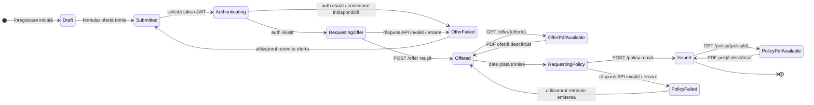

# Diagrama de stări - Calculator RCA

Diagrama urmărește ciclul de viață al unei înregistrări din `rca_calculations`.

## Stări persistate

| Stare | Valoare în baza de date | Semnificație |
| --- | --- | --- |
| Draft | `draft` | stare implicită a unei înregistrări |
| Submitted | `submitted` | datele ofertei au fost salvate înaintea apelului API |
| Offered | `offered` | oferta a fost obținută și `offer_id` este salvat |
| Offer failed | `offer_failed` | obținerea ofertei a eșuat |
| Policy failed | `policy_failed` | emiterea poliței a eșuat |
| Issued | `issued` | polița a fost emisă și `policy_id` este salvat |

`Authenticating`, `RequestingOffer`, `RequestingPolicy`, `OfferPdfAvailable` și `PolicyPdfAvailable` sunt stări operaționale ale fluxului, nu valori persistate în coloana `status`.

## Trasabilitate

Tranzițiile sunt înregistrate în `rca_audit_events`, inclusiv:

- cererea și răspunsul pentru ofertă;
- eșecul autentificării sau al obținerii ofertei;
- cererea și răspunsul pentru poliță;
- eșecul emiterii poliței;
- descărcarea PDF-ului de ofertă sau poliță.
